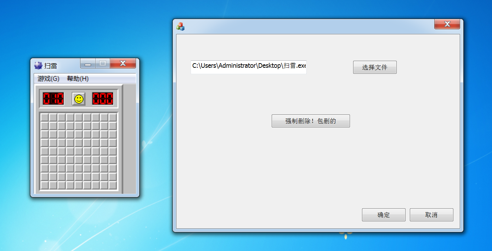
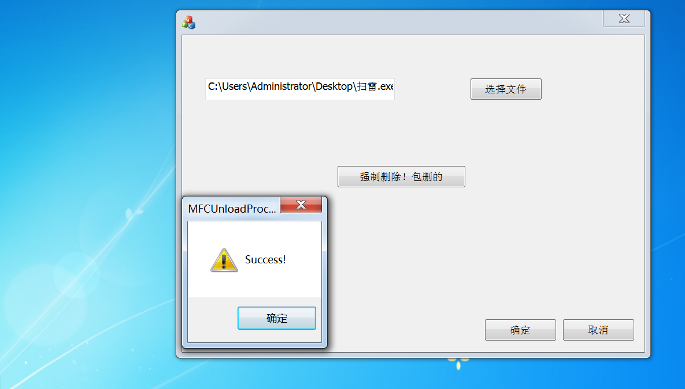

# Windows x64内核

## 强制关闭进程

在用户模式下平时想关闭一些软件一般可以在windows自带的任务管理器关闭，但是某些进程，例如安全软件，或者某些病毒，这些权限比较高在内核态，就删不掉。所以我们就需要在内核驱动将其杀死

常见的有三种方法：

- 1.标准方法就是使用`ZwOpenProcess`打开进程获得句柄，然后使用`ZwTerminateProcess`这个内核API实现结束进程，最后使用`ZwClose`关闭句柄。
- 2.第二种方法，通过动态定位的方式找到`PspTerminateThreadByPointer`这个内核函数地址，然后调用该函数结束掉进程中所有的线程，当线程为空则进程也就消亡了。
- 3.第三种方法，我将其称作是内存清零法，其核心原理是通过打开进程，得到进程的基址，通过内存填充的方式将对端内存全部置0实现类似于结束的效果。


### 优缺点

讲讲这三个的优缺点：

`ZwTerminateProcess`：

**安全性高**：这种方法是标准的、合法的内核API调用，不涉及系统内存的非法操作或直接修改内核结构，减少了系统不稳定的风险。  **兼容性好**：适用于大多数系统和硬件平台，使用的是微软公开的API。

但是！这玩意操作很容易被回调函数过滤掉， 由于内核回调会监控进程终止请求，`ZwTerminateProcess`是一个标准的内核API，回调函数可以截获并拒绝这种终止请求。如果安全软件或者病毒的回调阻止了对其进程的操作，则**该方法将无效**。 


`PspTerminateThreadByPointer`

**优点：**

通过动态定位`PspTerminateThreadByPointer`内核函数的地址，强行终止进程中的所有线程。当进程中的所有线程被终止时，进程也会自然消亡。`PspTerminateThreadByPointer`属于低级内核函数，调用它可以直接终止进程的线程，而不是使用标准的API。因为这是非公开的、较低层的内核函数，回调机制不一定能拦截或监控到对它的调用，因此有可能绕过内核回调保护。


**缺点：**

**危险性高**：因为是非公开的内核函数，直接调用可能引起系统不稳定或蓝屏。此外，不同版本的操作系统可能修改该函数的实现或地址，造成兼容性问题。

**维护复杂**：需要动态定位函数地址，并且随着系统更新，该函数位置和实现方式可能会变化，必须定期维护代码。

**不合法**：非官方、未公开的API调用可能触发系统安全机制或被安全软件检测为恶意行为。


 `内存清零法` 

优点：

- **终止效果彻底**：直接操作内存使目标进程失效，可以绕过权限和保护机制。
- **灵活性高**：可以自行定义要清除的内存范围，部分进程可能在被清零后仍会保留基本信息。

**缺点**：

- **极高风险**：不当的内存操作极易导致系统崩溃或蓝屏，特别是对系统进程和核心服务操作时，可能会破坏系统的稳定性。
- **不可控**：清空进程内存的行为很难控制，可能会留下不完整的资源和文件句柄，导致系统出现僵死进程或资源泄露。
- **不推荐用于关键系统进程**：该方法本质上是强行破坏系统内存，不应轻易在生产环境中使用。


## `PspTerminateThreadByPointer`关闭进程

本篇只讲通过`PspTerminateThreadByPointer`强制关闭进程


一把辛酸泪啊，早就该写完了，但是一直因为引用计数蓝屏，调试了两个小时，终于发现问题了

RNM！`PsGetThreadProcess`获取的对象不需要`ObDereferenceObject`!!!!!!!!!我真的哭死，该死的GPT木鱼脑袋，也没发现出来，我是真服了呀


另外，通过查阅资料，线程ID在同一时间内也是独一无二的，否则`PsLookupProcessByProcessId`就需要指定进程了


代码如下：

```C++
VOID Delete_Process()
{
    KdBreakPoint();
    // 获取 PspTerminateThreadByPointerPtr 函数地址
    unsigned char* Func_Ptr = (unsigned char*)PsTerminateSystemThread;
    while (*Func_Ptr != 0xE8)
    {
        Func_Ptr++;
    }

    Func_Ptr++;
    int Offset = *(int*)Func_Ptr;
    NTSTATUS(*PspTerminateThreadByPointer)(PETHREAD pEThread, NTSTATUS ntExitCode, BOOLEAN bDirectTerminate);
    PspTerminateThreadByPointer = (NTSTATUS(*)(PETHREAD, NTSTATUS, BOOLEAN))(Func_Ptr - 1 + Offset + 5);

    NTSTATUS status;

    PEPROCESS pEProcess;
    // 获取结束进程的进程结构对象EPROCESS
    status = PsLookupProcessByProcessId((HANDLE)0x8dc, &pEProcess);
    if (!NT_SUCCESS(status))
    {
        KdPrint(("PsLookupProcessByProcessId Error"));
        return;
    }

    // 遍历所有线程，并结束所有指定进程的线程
    for (ULONG64 i = 4; i < 0x80000; i += 4)
    {
        //KIRQL oldIrql;
        //// 提升到 HIGH_LEVEL 以禁用中断
        //KeRaiseIrql(HIGH_LEVEL, &oldIrql);

        PETHREAD pEThread;
        status = PsLookupThreadByThreadId((HANDLE)i, &pEThread);
        if (NT_SUCCESS(status))
        {
            PEPROCESS pThreadEProcess = nullptr;
            // 获取线程对应的进程结构对象
            pThreadEProcess = PsGetThreadProcess(pEThread);

            if (pThreadEProcess != nullptr && pEProcess == pThreadEProcess)
            {
                // 结束线程
                PspTerminateThreadByPointer(pEThread, 0, 1);
                DbgPrint("PspTerminateThreadByPointer Thread:0x%x\n", i);
            }

            // 必需 Dereference，否则在某些时候会造成蓝屏
            if (pEThread != nullptr)
                ObDereferenceObject(pEThread);

            // 确保线程对应的进程对象有效
            /*if(pThreadEProcess!=nullptr)
                ObDereferenceObject(pThreadEProcess);*/
            
        }

        //// 恢复原始 IRQL
        //KeLowerIrql(oldIrql);
    }
    
    KdPrint(("Finish\n"));
    if (pEProcess != nullptr)
        ObDereferenceObject(pEProcess);
}
```


写一个三环程序配合使用

这里记录下MFC获取文件夹和文件路径的代码：

两个编辑框先绑定好变量：

**按钮事件（获取文件夹路径）**

```c++
void CMFCUnloadProcessDlg::OnBnClickedButton1()
{
	// TODO: 在此添加控件通知处理程序代码
	TCHAR szPath[MAX_PATH] = { 0 };
	LPITEMIDLIST pitem;
	BROWSEINFO info;
	::ZeroMemory(&info, sizeof(info));
	info.hwndOwner = this->m_hWnd;
	info.lpszTitle = TEXT("请选择路径:");
	info.pszDisplayName = szPath;
	if (pitem = ::SHBrowseForFolder(&info))
	{
		::SHGetPathFromIDList(pitem, szPath);
		FileName = szPath;
		UpdateData(FALSE);
	}
}
```


**按钮事件（获取文件代码）**

```C++
void CMFCUnloadProcessDlg::OnBnClickedButton3()
{
	// TODO: 在此添加控件通知处理程序代码
	CFileDialog dlg(TRUE,               // 打开文件对话框
		NULL,          // 默认扩展名为 "txt"
		NULL,               // 无初始文件名
		OFN_HIDEREADONLY | OFN_FILEMUSTEXIST,  // 标志：隐藏只读复选框，文件必须存在
		NULL, // 文件过滤器
		this);              // 父窗口为当前对话框

	if (dlg.DoModal())
	{
		Process_Path = dlg.GetPathName();
	}
	UpdateData(FALSE);
}
```


`DriverObject->MajorFunction[IRP_MJ_CREATE]`代码：

```C++
NTSTATUS MyWrite(PDEVICE_OBJECT DeviceObject, PIRP Irp) {
    //KdBreakPoint();
    DeviceObject;
    // PIO_STACK_LOCATION pIrpStack = IoGetCurrentIrpStackLocation(Irp);
    VOID* lpBuf = Irp->UserBuffer; // Use SystemBuffer
    if(!lpBuf)
        lpBuf = Irp->AssociatedIrp.SystemBuffer;

    KdPrint(("Write\n"));
    
    __try {
        //DEVICE_EXTENSION* device_extension_ptr = (DEVICE_EXTENSION*)DeviceObject->DeviceExtension;
        // Validate and probe user buffer
        if (MmIsAddressValid(lpBuf)) {
            ProbeForRead(lpBuf, sizeof(lpBuf), 1);
        }
        else {
            KdPrint(("Invalid user buffer address\n"));
            Irp->IoStatus.Status = STATUS_INVALID_USER_BUFFER;
            Irp->IoStatus.Information = 0;
            IoCompleteRequest(Irp, IO_NO_INCREMENT);
            return STATUS_INVALID_USER_BUFFER;
        }

        UNICODE_STRING unicodeStr;
        RtlInitUnicodeString(&unicodeStr, (PCWSTR)lpBuf);

        Pid = WideStringToULong(unicodeStr);
        Irp->IoStatus.Status = STATUS_SUCCESS;
        Irp->IoStatus.Information = wcslen((const wchar_t*)lpBuf) * sizeof(TCHAR);
    }
    __except (EXCEPTION_EXECUTE_HANDLER) {
        KdPrint(("Exception occurred: Access violation\n"));
        // Set IRP status for exception
        Irp->IoStatus.Status = GetExceptionCode();
        Irp->IoStatus.Information = 0;
    }
    // Complete the request
    IoCompleteRequest(Irp, IO_NO_INCREMENT);
    KdPrint(("0x%x", Pid));


    Delete_Process();
    Pid = 0;

    return Irp->IoStatus.Status;
}
```


`三环代码`

```C++
void CMFCUnloadProcessDlg::OnBnClickedButton4()
{
	// TODO: 在此添加控件通知处理程序代码

	DWORD Pid=GetProcessIDByPath(Process_Path.GetBuffer());
	char buffer[10];
	
	HANDLE hDevice = CreateFile(L"\\\\.\\MyDevice_Link", GENERIC_READ | GENERIC_WRITE, 0, NULL, OPEN_EXISTING, FILE_ATTRIBUTE_NORMAL, NULL);
	if (hDevice == INVALID_HANDLE_VALUE) {
		CString errorMsg;
		errorMsg.Format(L"Failed to open device. Error code: %d", GetLastError());
		AfxMessageBox(errorMsg);
		return;
	}
	
	wchar_t Pid_Str[20];
	wsprintf(Pid_Str, L"%lu", Pid);
	
	ULONG bytesReturned = 0;
	if (!WriteFile(hDevice, Pid_Str, wcslen(Pid_Str), &bytesReturned, NULL)) {
		CString errorMsg;
		errorMsg.Format(L"Failed to write to device. Error code: %d", GetLastError());
		AfxMessageBox(errorMsg);
		CloseHandle(hDevice);
		return;
	}
	AfxMessageBox(L"Success!");
	CloseHandle(hDevice);
}
```


效果如图：




应用消失之术




当你调用 `ObReferenceObjectByHandle` 并传入一个句柄时，该函数会根据当前进程的句柄表来解析句柄。

如果你在不同进程中调用 `ObReferenceObjectByHandle`，即使传入相同的句柄值，系统会根据**各自进程的句柄表**来查找对象，因此返回的内核对象可能不同。


 `ObReferenceObjectByPointer` 是 Windows 内核中的一个函数，用来增加内核对象的引用计数，以确保对象在系统中不会被意外删除。 可以用来判断总数